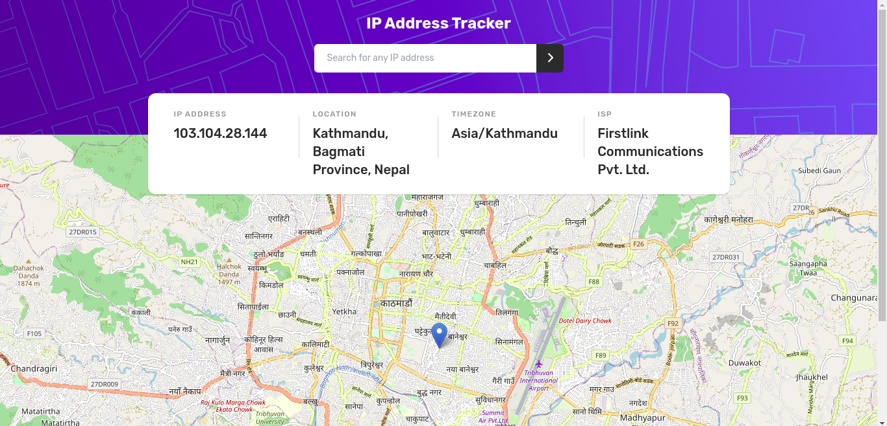

# Frontend Mentor - IP address tracker solution

This is a solution to the [IP address tracker challenge on Frontend Mentor](https://www.frontendmentor.io/challenges/ip-address-tracker-I8-0yYAH0). Frontend Mentor challenges help you improve your coding skills by building realistic projects. 

## Table of contents

- [Overview](#overview)
  - [The challenge](#the-challenge)
  - [Screenshot](#screenshot)
  - [Links](#links)
- [My process](#my-process)
  - [Built with](#built-with)
  - [What I learned](#what-i-learned)
  - [Continued development](#continued-development)
  - [Author](#author)

## Overview

### The challenge

Users should be able to:

- View the optimal layout for each page depending on their device's screen size
- See hover states for all interactive elements on the page
- See their own IP address on the map on the initial page load
- Search for any IP addresses or domains and see the key information and location

### Screenshot

### Links

- Solution URL: [https://github.com/coderSuresh/ip-address-tracker](https://github.com/coderSuresh/ip-address-tracker)
- Live Site URL: [https://ip-tracker-codersuresh.netlify.app/](https://ip-tracker-codersuresh.netlify.app/)

## My process

### Built with

- React
- Tailwind CSS
- Leaflet Map
- Ipapi API

### What I learned

I learned how to use leaflet map and how to use tailwind css in react. I also learned how to use ipapi api to get the ip address details.
  
### Continued development

Use Ipify API so that user can get the location details of any ip address or domain name.

## Author

- Frontend Mentor - [@codersuresh](https://www.frontendmentor.io/profile/codersuresh)
- Linkedin - [@codersuresh](https://www.linkedin.com/in/codersuresh/)
